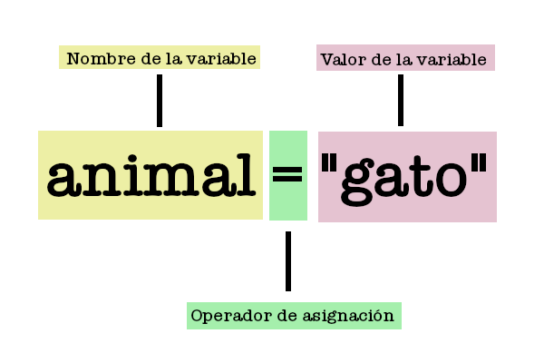

# Variables

    Una definición simple es: La variable es un nombre o expresión que nos permite guardar un valor. 
    En palabras técnicas: una variable está formada por un espacio en el sistema de almacenaje (memoria principal de un ordenador)y un nombre simbólico (un identificador) que está asociado a dicho espacio.

Una variable está compuesta por 3 componentes:

* Nombre: Por lo general es una palabra que describe lo que deseamos guardar. 
* Operador de asignación: Es el símbolo “=” que describe la asignación del valor a la variable.
* Valor: Es el dato guardamos en esta variable.

    

Recursos:

* Qué es una variable: https://es.wikipedia.org/wiki/Variable_(programaci%C3%B3n)
* Python shell: https://www.tutorialsteacher.com/python/python-interective-shell